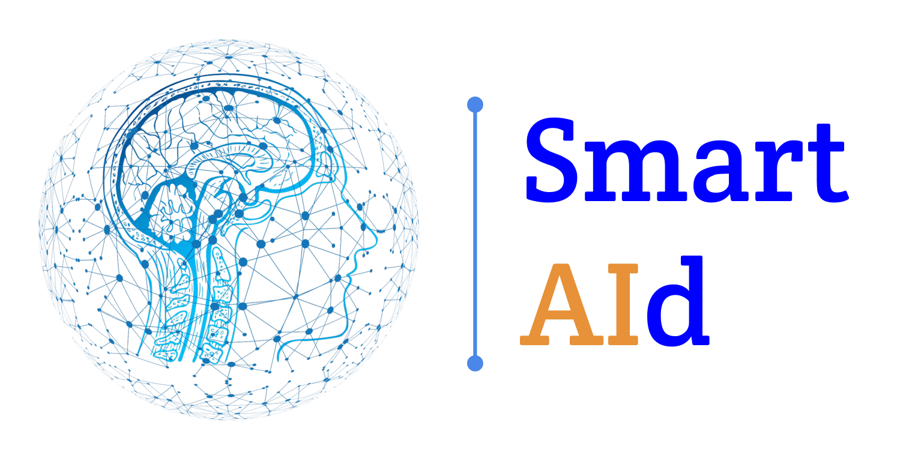
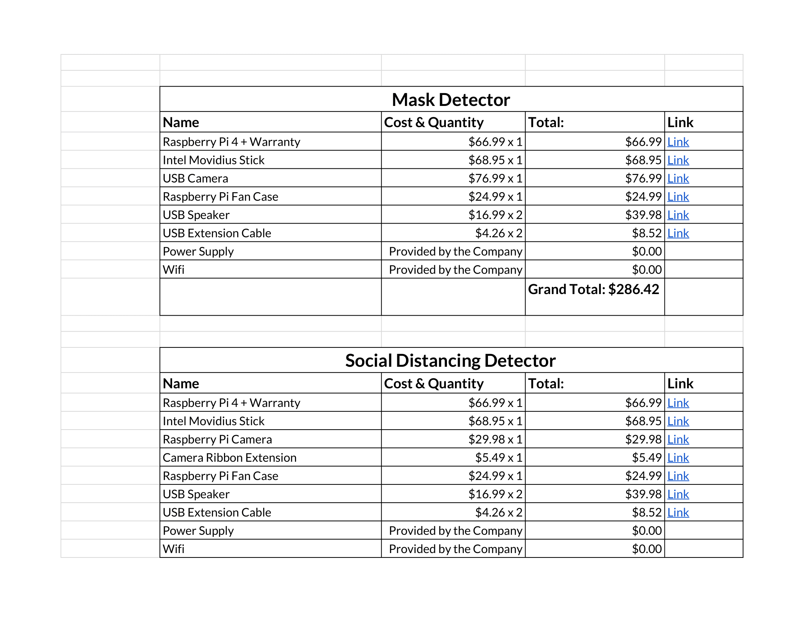
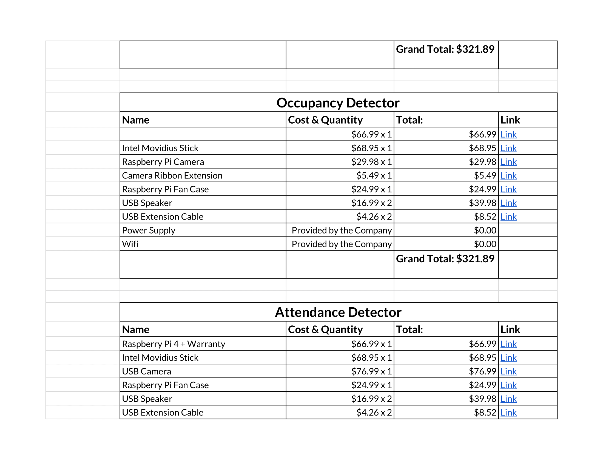
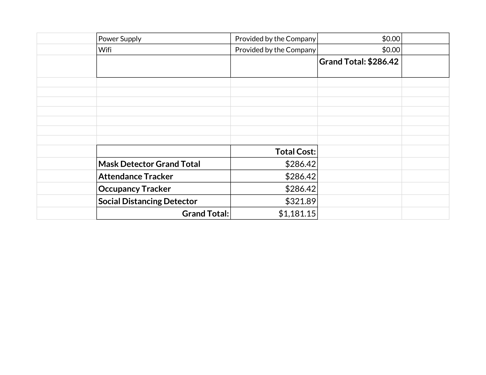

# Smart_AId

Link:(https://docs.google.com/drawings/d/1tL8almkakg1py_vwmerM944xJadmECa3oJQoNZ7X9qU/edit?usp=sharing)

## Introduction

We at Smart_AId, (Abhisar Anand, Aditya Anand, Arsh Sharma, Srinivas Sriram) participated in the Girls Computing League's 4th AI Innovation Business Summit. We decided to create 4 different products in response to the COVID-19 pandemic going on in the world right now. These products aim to make reopening of businesses and schools in this unfamiliar time as easy as possible, with the help of AI, Deep Learning, Raspberry Pi's + Intel Movidius Sticks, and Cameras. These are our four products as well as how our code works.


## 1. Mask Detector

### Why we did it 
One of the most simple ways to prevent the spread of the virus is simply to wear a mask or face covering. However, many people forget to do this simple task, and this can easily spread the virus. In response to this, we created a mask detector that can be fitted at the entrance of a building to detect if people are wearing a face mask as they enter the building. 

### How we built it.
To start with, we had to be able to choose a model that was able to run on the Raspberry Pi 4 + Intel Movidius Stick. So for that, we used a face detection model caffe model for detecting if a face is there, a pytorch model for extracting and embedding the face, and finally, a linear SVM scikit-learn machine used for recognizing and predicting the class of the face (with or without mask). Here are some code snippets containing how we trained/used these models. 

Loading face detection caffe model:
```
self.detector = cv2.dnn.readNetFromCaffe(os.path.join(
            os.path.dirname(os.path.realpath(__file__)),
             "face_detection_model/deploy.prototxt"),
            os.path.join(
                os.path.dirname(os.path.realpath(__file__)),
                "face_detection_model/res10_300x300_ssd_iter_140000.caffemodel"))

        self.detector.setPreferableTarget(cv2.dnn.DNN_TARGET_MYRIAD)
 
```

Loading face extraction/embedding pytorch model:
```
self.embedder = cv2.dnn.readNetFromTorch(os.path.join(
            os.path.dirname(os.path.realpath(__file__)),
            "face_embedding_model/openface_nn4.small2.v1.t7"))

        self.embedder.setPreferableTarget(cv2.dnn.DNN_TARGET_MYRIAD)
```

Training SVM Model:
```
        params = {"C": [0.001, 0.01, 0.1, 1.0, 10.0, 100.0, 1000.0],
          "gamma": [1e-1, 1e-2, 1e-3, 1e-4, 1e-5]}
        model = GridSearchCV(SVC(kernel="rbf", gamma="auto",
          probability=True), params, cv=3, n_jobs=-1)
        model.fit(data["embeddings"], labels)
```
Loading SVM Model:
```
        self.recognizer = pickle.loads(open(os.path.join(
            os.path.dirname(os.path.realpath(__file__)),
            "recognizer.pickle"), "rb").read())

        self.le = pickle.loads(open(os.path.join(
            os.path.dirname(os.path.realpath(__file__)),
            "labels.pickle"), "rb").read())
```
Predicting with SVM Model:
```
        self.predictions = self.recognizer.predict_proba(self.vec)[0]
        self.j = np.argmax(self.predictions)
        self.probability = self.predictions[self.j]
        self.name = self.le.classes_[self.j]
```

Now that you know what Deep Learning models we are using, let's talk about how we use them in real time. To start with, we use one of python's best open source computer vision libraries, OpenCV. We use OpenCV to start a video stream with the camera, and then constantly read each frame of the camera in a while True loop. In each frame, we detect for a face using our caffe model, and if a face is detected, we use our pytorch model to extract the face. We then pass this extracted face into our SVM Classifier, and then the Classifier predicts whether the person is or is not wearing a face mask. 

After the class label is outputted, we then take corresponding action. If the person is not wearing a face mask, we play a computer-generated warning asking the person to wear a mask. If the person is wearing a mask, we use Raspberry Pi's GPIO pins to send a signal to our motor controller, which then causes the motor to spin, which will open the door to allow the person inside. 

Code Snippet of OpenCV/Imutils Video Capture (USED IN ALL PRODUCTS):
```
    def start_video_stream(self):
        """
        This method will initialize the camera.
        :key
        """
        print("[INFO] starting video stream...")
        self.vs = VideoStream(src=0).start()
        time.sleep(2.0)
```

## 2. Attendance Tracker.

### Why we did it
The reason why we want to create an automatic attendance tracker is because we believe that companies and schools can use this technology in a lot of ways. For example, if a worker or employee has contracted the virus, the manager can use our data to see who was in the building at the time, and then take action to help quarantine them so they can keep going. Overall, we just feel like having an automatic attendance system not only saves the manager time, but also can provide valuable data to them, especially during the pandemic.

### How we built it
The Deep Learning involved in the Attendance System and the Mask Detector are very similar. They both utilize the face detection caffe model and the face embedding/extracting pytorch model. However, our SVM model was trained a bit differently. Instead of recognizing mask or no mask, we trained a model off of our faces so that it would recognize each of us. 

We loop through the video stream (mentioned on Mask Detector) and receive the person's name. Using that name, we play a customized message which says welcome specifically for that person. (ex. If Srinivas is detected, it will play Welcome Srinivas). After that, we open the door using Raspberry Pi GPIO pins (mentioned on Mask Detector) to let the person inside.

Code snippet for opening the door (USED FOR MASK AS WELL):
```
    def start_motor(self):
        """
        This method will use the Raspberry Pi GPIO PINS to start the motor to open the door.
        """
        print("[INFO]: Opening Door...")
        gpio.output(MOTOR1_FORWARD_GPIO, ON)

    def stop_motor(self):
        print("[INFO]: Stopping Motor...")
        gpio.output(MOTOR1_FORWARD_GPIO, OFF)
        
```
Code snippet of playing computer generated alarm (USED IN ALL PRODUCTS):
```
    @classmethod
    def play_abhisar_file(cls):
        """
        This method implements logic to play audio file.
        :return:
        """
        play_audio_successful = False
        try:
            speech_file_path = os.path.join(os.path.dirname(__file__), abhisar_sound_path)
            print("Trying to open {}.".format(speech_file_path))
            return_code = subprocess.call(["aplay", speech_file_path])
            play_audio_successful = True
        except KeyboardInterrupt:
            print('\nInterrupted by user')
        except Exception as e:
            print(type(e).__name__ + ': ' + str(e))
        else:
            print("Played {} with return code {}.".format(speech_file_path, return_code))
        finally:
            return play_audio_successful
```


## 3. Occupancy Tracker.

### Why we did it
Recently, the CDC issued a statement that in public places, there has to be a limit for the number of people. However, often times there is nobody who tells people who try to enter that they cannot enter due to the max occupancy. This means that people are at risk of contracting the virus due to there being too many people. Our product will track the people's movements, determine if they are entering or exiting, and keep a count of how many people are in the building. If the max occupancy has been crossed, an alarm will play telling people that there are too many people in the building, and to wait til somebody leaves.

### How we built it
As like the Mask and Attendance Detectors, we needed to find or train Deep Learning models that were able to run on the Raspberry Pi + Movidius Stick. So we proceeded to use a object detector caffe model. The reason why we chose this model is because this model was accurately able to detect humans. Here is a code snippet which shows how we load and use our caffe model.

Loading object detector caffe model:
```
        self.net = cv2.dnn.readNetFromCaffe(os.path.join(
            os.path.dirname(os.path.realpath(__file__)),
            "models/MobileNetSSD_deploy.prototxt"),
            os.path.join(
                os.path.dirname(os.path.realpath(__file__)),
                "models/MobileNetSSD_deploy.caffemodel"))


```
Using object detector caffe model:
```
        self.net.setInput(self.blob)
        self.detections = self.net.forward()

        for i in np.arange(0, self.detections.shape[2]):
            self.confidence = self.detections[0, 0, i, 2]
            if self.confidence > 0.5:
                self.idx = int(self.detections[0, 0, i, 1])
                self.label = round(self.idx)
```

Now let's talk about how our occupancy tracker works. To start off, we open a video stream and read each frame through OpenCV. We then check if a human is detected, and if a human is detected, we use centroid tracking to track the person's movement by extracting the position coordinates as the person moves. We then see how the person's coordinates change over time, and then determine if the person entered or exited the building, and then increment or decrement the count accordingly. Here is some code which shows how we do the tracking.

```
human_tracker_object = cls.human_tracking_dict.get(objectID, None)

            # if there is no existing trackable object, create one
            if not human_tracker_object:
                Logger.logger().debug("Creating a new speed tracker object with object id = {}.".format(objectID))
                human_tracker_object = HumanTracker(objectID, centroid)
                cls.human_tracking_dict[objectID] = human_tracker_object

            else:
                human_tracker_object.centroids.append(centroid)
                human_tracker_object.timestamp_list.append(datetime.now())
                yield human_tracker_object, objectID, centroid
```

Now that we have a count of how many people are in the building, we keep monitoring that count, and if that count exceeds a customizable limit which the business can change, another computer generated warning will play, telling the person who tries to enter that the max occupancy has been reached. 

One feature that our product has is the ability to share the count that the camera detects with one door to other cameras which may be placed in other doors. This means that even if a person enters through one door and exits through another, our product will still have an accurate count. We accomplish this through a python API called socket, which can quickly send data between two IP addresses.

Code snippet of socket API in action:

```
Logger.logger().info('Server {} method_for_receiving_face_detected_by_peer: Waiting for a '
                     'connection'.format(server_address))
conn, addr = s.accept()
with conn:
    Logger.logger().info('Server {}: received connection from peer {}.'.format(server_address, addr))
    while SendReceiveMessages.run_program:
        Logger.logger().info("Run program is set to True.")
        data = conn.recv(MAX_NUMBER_OF_RCV_BYTES)
        if data:
            Logger.logger().debug('Server {}: received {} from peer {}.'.format(server_address, data, addr))
            data = data.decode('utf-8')
            self.__total_faces_detected_by_peer = int(data)
            Logger.logger().debug("Server {}: total_faces_detected_by_peer = {}".format(
                server_address, self.__total_faces_detected_by_peer))
        else:
            Logger.logger().debug("server method_for_receiving_face_detected_by_peer: data is Null")

```

## 4. Social Distancing Detector

### Why we did it
Like wearing a mask, one of the very first precautions that doctors recommended was to maintain a 6 ft. distance between each other. This however, is one of the biggest precautions I have seen people break. Usually, in stores, there are 2 pieces of tape to mark 6 feet. However, there is nobody to actually monitoring to check if people are social distancing. Our product is a simple and easy way for people to follow this rule. We calculate the distance between the two people, and if the distance is less than 6 feet, an alarm will play, signaling that the people should social distance. 

### How we built it
Our product uses the same Deep Learning Model caffe model for detecting humans as the Occupancy Tracker. (Look at Occupancy Tracker section to see how we use the caffe model). 

Now, we start a OpenCV video capture, loop over frames, detect for humans, and if more than 1 human is detected, we extract their position coordinates. We then proceed to do some math calculations to figure out the distance between the individuals, and if the distance is less than 6, we play the computer generated sound.
### Math Explanation
To find the distance between two people, we realized that we can calculate the distance from the camera to a person, and if there are two people and the camera we can form a triangle and we will calculate the distance and we can find the two lengths of the triangle. We found these measurements by using the first function as displayed below which supported us in finding the distance between the camera and a person. First we used the focal point of the camera to figure out how far they are and used linear regression to get results that can be translated and make sense to ua. To calculate the angle we used three points, first point being first person center point, second point is the bottom point of the camera and the third point being the midpoint of the second person. We used the law of cosines to find the third side which is the distance between two people so that helps us figure out if they are correctly social distancing and if they are closer than 6 feet, our detector will automatically sound notifying them that they are not 6 feet apart. We can confirm that the distance will always be accurate due to the mathematical logic that SAS provides to us to ensure that the calculations are always correct.  

Calculating math for social distancing:
```
import math
from constants import cam_focal_point

def calcDistance(x):
    y = cam_focal_point / x * 12
    # y = 275 / x * 12
    y = round(y)
    return y


def get_angle(a, b, c):
    angle1 = (abs(math.atan2(c[1] - b[1], c[0] - b[0]) - math.atan2(a[1] - b[1], a[0] - b[0])))
    angle2 = (abs(math.degrees(math.atan2(c[1] - b[1], c[0] - b[0]) - math.atan2(a[1] - b[1], a[0] - b[0]))))
    return round(angle1, 0), round(angle2, 0)


def finalDist(firstSide, angle, secondSide):
    thirdSide = math.sqrt((secondSide ** 2) + (firstSide ** 2) - 2 * secondSide * firstSide * math.cos((angle * (math.pi) / 180 )))
    thirdSide = 2*thirdSide + 0.6
    thirdSide += 1
    return round(thirdSide)
```


# Cost





